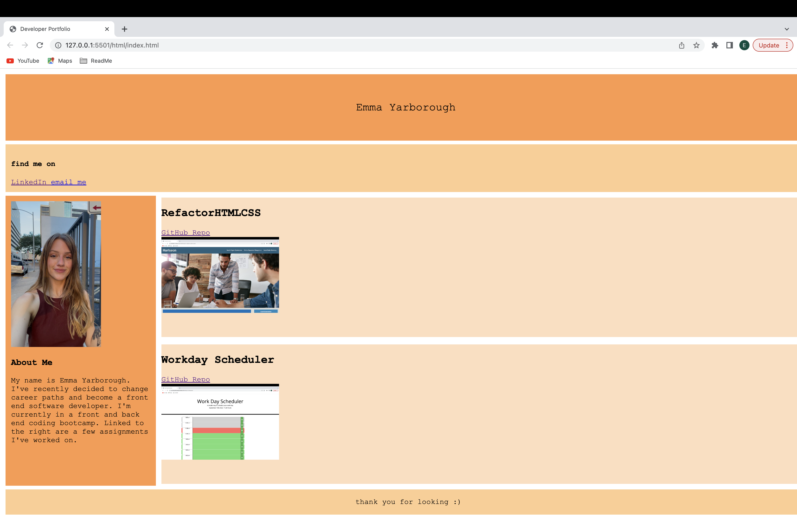

# Portfolio
I created a portfolio to have a space I can show what I've been working on. It also is a continuous project I'd like to keep tweaking and changing. 

## Links 
[Repo Link](https://github.com/carsonyarborough/ProgrammingPortfolio)

[Deployed Link](https://carsonyarborough.github.io/ProgrammingPortfolio/)